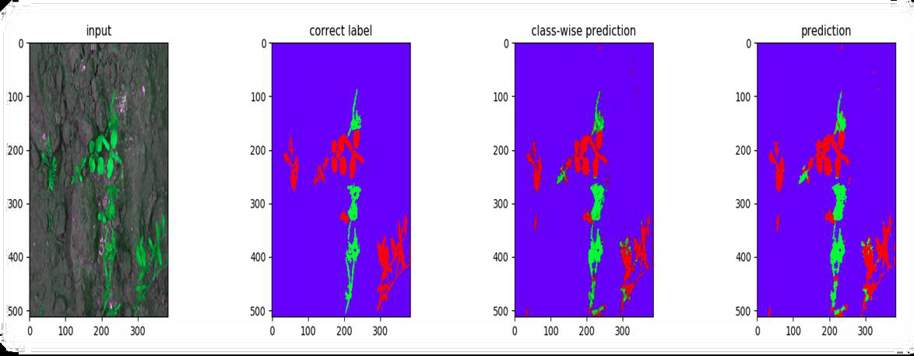
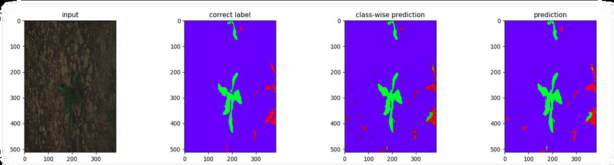
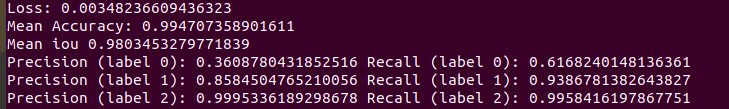
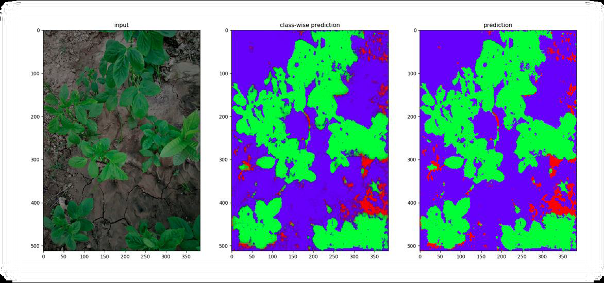
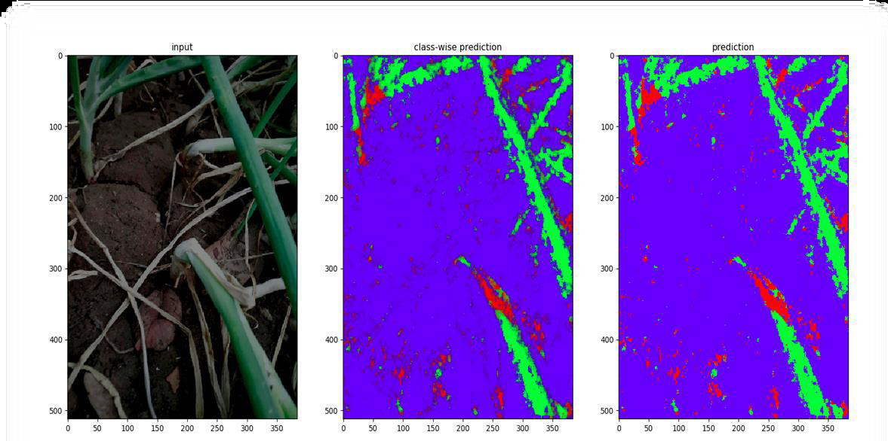

  <h1>Autonomous-Farm-Robot(AGRIBOT)</h1>   
 
 
## About the Project

The primary objective of this project is to design an autonomous agricultural robot specifically
used for the removal of weed on the real-time basis without any human involvement. This will
help to offer better and nutrients rich yield involving less man-power than the conventional
agriculture. This project can also be extended to design robot various other applications involved
in farming like ploughing, harvesting, etc. in turn making agriculture more autonomous and
providing better yields which in turn will impact on the country’s GDP and lesser farmer suicide
rates.It is a <b>UG project</b> under guidance of <b>TEQIP-3</b> and <b>ECE Department</b> at <b>SVNIT</b>.

     

## Our published paper at the AVES 2021 conference
**"Design of an Autonomous Agricultural Robot for Real Time Weed Detection using CNN"**, **Dhruv Patel1, Meet Gandhi1, ShankaraNarayanan H.1** and Anand Darji, published at the **[AVES 2021](https://aves2021.org/) conference**. [[Paper]](https://drive.google.com/file/d/1Ss4o4EYnGEhrGYFlM-2nI51QStGxraFL/view?usp=sharing)
- We have proposed system-design of the Autonomous Farm Robot which includes various modules such as Embedded and Mechanical system design, modeling and simulation of Robot, path-planning, and Deep Learning for crop-weed classification.
- We will provide the citation soon. 
   

## Folder Organization

 
Mainly project is divided into two part, i.e. Autonomous Navigation & Crop Weed Classification. The main Autonomous-Farm-Robot contains all of the documentation and scripts required for the project, broken down into the four sections: Classification Model, Dataset Analysis, Documentation, and agribot_ws. We have created [Wiki](https://github.com/Dhruv2012/Autonomous-Farm-Robot/wiki "https://github.com/Dhruv2012/Autonomous-Farm-Robot/wiki") for better understanding for our project.

- **Crop_Weed_Classification:** Contains scripts for classification task.
- **agribot_ws:** Catkin workspace for navigation and modelling.
- **Documents:** Documentation of the project. Includes Project Report & Presentation, Proposal, Research Papers etc.
- **Datasets(Git):** For Analysis of Datasets. [Bonn Dataset](https://www.ipb.uni-bonn.de/data/sugarbeets2016/ "https://www.ipb.uni-bonn.de/data/sugarbeets2016/") contains samples with missing images. So, there is a need to remove such samples. We have listed these samples which contains missing images in it. 

## Wiki
For more details about project and implementation of modules, visit below links:
1. [Autonomous Navigation](https://github.com/Dhruv2012/Autonomous-Farm-Robot/wiki/Autonomous-Navigation "https://github.com/Dhruv2012/Autonomous-Farm-Robot/wiki/Autonomous-Navigation") 
2. [Configure Jetson Nano for Remote access](https://github.com/Dhruv2012/Autonomous-Farm-Robot/wiki/Configuring-Jetson-Nano "https://github.com/Dhruv2012/Autonomous-Farm-Robot/wiki/Configuring-Jetson-Nano")
3. [Crop Weed Classification](https://github.com/Dhruv2012/Autonomous-Farm-Robot/wiki/Crop-Weed-Classification "https://github.com/Dhruv2012/Autonomous-Farm-Robot/wiki/Crop-Weed-Classification")
4. [Electronics Components and Sensor Modelling](https://github.com/Dhruv2012/Autonomous-Farm-Robot/wiki/Electronics-Components-and-Sensor-Modelling "https://github.com/Dhruv2012/Autonomous-Farm-Robot/wiki/Electronics-Components-and-Sensor-Modelling")

## Features
### 1. Autonomous Navigation
First we designed our generalized robotic structure using Solidworks-2016 and generated URDF for same and then spawn our model into GAZEBO. Crops were designed as cylindrical shape and given texture of plants, further we can design using 3D modelling software like  Blender. Other models were taken from Gazebo model library. At this  stage, We've  used GPS & Magnetometer for autonomous  traversing in field. For reduction of sensor noise, we implemented Moving Median and Single dimention  Kalman  Filter.  You can find scripts in  `agribot_ws/src/autonomous_drive`.  For installation of pkgs and dependencies visit [Autonomous Navigation](https://github.com/Dhruv2012/Autonomous-Farm-Robot/wiki/Autonomous-Navigation) wiki page.        
**Note:** Here, 
1. Left side window: Mapviz, Right side window: Gazebo
2. Green points are end points of row in field, Blue line is traced trajectory of AGRIBOT.
3. Image window from Camera is being directly fed into classification model.

#### Sensor Noise Reduction (Left: Moving Median, Right: Kalman Filter)

### 2. Crop Weed Classification

We trained and tested 2 models: UNet & Bonnet on Datasets namely: [CWFID](https://github.com/cwfid/dataset "https://github.com/cwfid/dataset") & [Bonn](https://www.ipb.uni-bonn.de/data/sugarbeets2016/ "https://www.ipb.uni-bonn.de/data/sugarbeets2016/"). **Bonnet Architecture** by [PRBonn](https://github.com/PRBonn) (Photogrammetry & Robotics Lab at the University of Bonn) can be viewed [here](https://github.com/Dhruv2012/Autonomous-Farm-Robot/blob/master/Documents/Research%20Papers/Crop_Weed_Classification/1709.06764.pdf). Implementation of both architecture is done in `Crop_Weed_ Classification/model.py`. Bonnet performed better than its UNet counterpart and was suitable for real-time deployment due to its approx. 100x lesser parameters compared to UNet. Hence, **Bonnet** was selected as the final classification model.
 

**NOTE:** Here, Red => Weed, Green => Crop and Blue => Soil.

#### Prediction on CWFID Dataset: 

#### Prediction on Bonn Dataset:

#### Metrics on Bonn Dataset:

- Label 0,1,2 are in order of Weed,Crop and Soil(i.e. R,G,B).

#### Real-time latency:  
Avg. 2.5 fps on i7 8th Gen + 4GB NVIDIA 940 MX.

#### Prediction on images from Surrounding Farm:

**NOTE:** For setting up environment,understanding of scripts and **model weights**, visit [Crop-Weed-Classification Wiki](https://github.com/Dhruv2012/Autonomous-Farm-Robot/wiki/Crop-Weed-Classification) page.

## Project Build-Map     

Various Sensor such as NEO-M8N GPS, MPU-9265 and Raspberry PI Cam-v2 were integrated on Nvidia Jetson Nano. However, due to COVID-19 pandemic, further development on hardware was not possible. Hence, we shifted our approach on simulation-basis. We tested our software and algorithms through modelling and simulation and have tried to make it close to real-case scenarios. For Eg: Modelling Sensors with noise to create a real-case scenario. 

## Project Report
Access the Project Report at `Documents/G-13 UG Project Report.pdf`.

## Happy building!!:rocket::rocket:

Feel free to raise an issue if you face any problems while implementing the modules. If you have any questions or run into problems during understanding of our project, please reach out to us through mail. We would be happy to share as much as possible.

 

Email ID: 
[farmbot.svnit@gmail.com](mailto:farmbot.svnit@gmail.com)

## Project Team
Project Guide:\
Dr. Anand Darji,\
Head & Associate Professor,\
ECED, SVNIT.

Development Team:\
[Dhruv Patel](https://github.com/Dhruv2012 "https://github.com/Dhruv2012")(U16EC053, SVNIT)\
[Meet Gandhi](https://github.com/mEET126 "https://github.com/mEET126")(U16EC056, SVNIT)\
[Shankaranarayanan H.](https://github.com/shankar59 "https://github.com/shankar59") (U16EC074,SVNIT)

Special Thanks To:
**Mr. Mahesh Birajdar(U16ME084),SVNIT** and [*Team DRISHTI*](https://github.com/DRISHTI-SVNIT) for helping us in solidwork designing and manufacturing of AGRIBOT.
