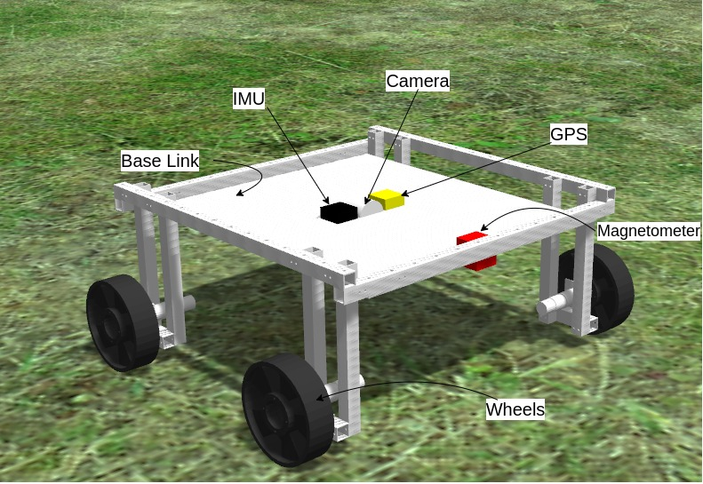
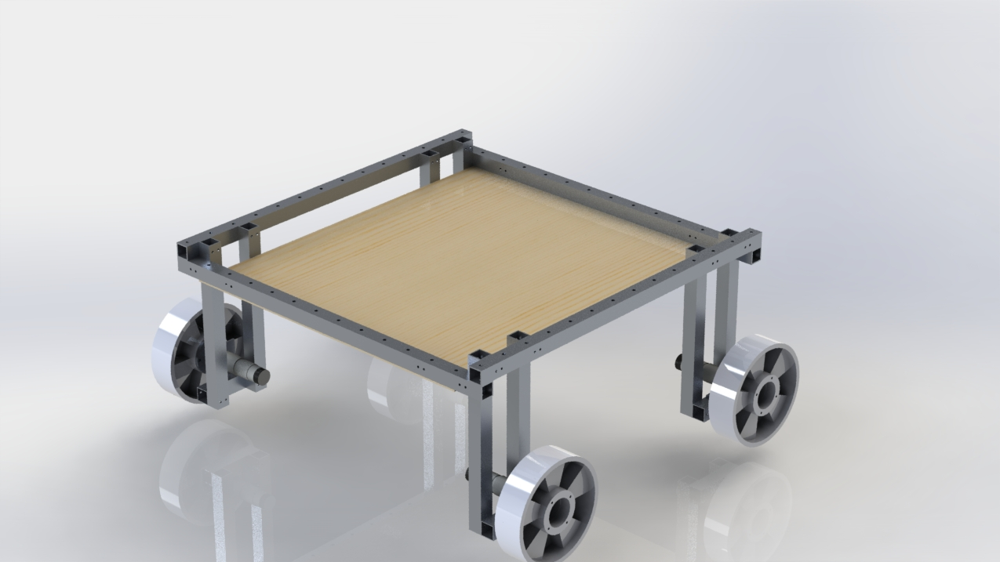
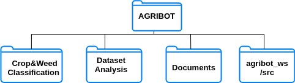
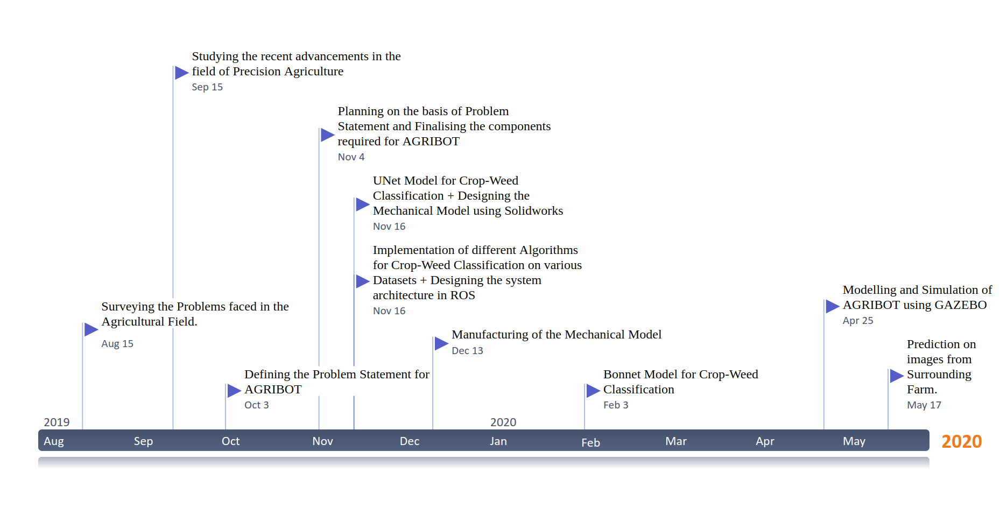

# Autonomous-Farm-Robot(AGRIBOT)
The primary objective of this project is to design an autonomous agricultural robot specifically
used for the removal of weed on the real-time basis without any human involvement. This will
help to offer better and nutrients rich yield involving less man-power than the conventional
agriculture. This project can also be extended to design robot various other applications involved
in farming like ploughing, harvesting, etc. in turn making agriculture more autonomous and
providing better yields which in turn will impact on the country’s GDP and lesser farmer suicide
rates.It is a UG project under guidance of TEQIP-3 and ECE department at SVNIT.

## Folder Organization:

## Features:
### Autonomous Navigation

     
## Project Build-Map:     

## Wiki
For more details about project, visit below links:\
1. [*Configure Jetson Nano for Remote access*](https://github.com/Dhruv2012/Autonomous-Farm-Robot/wiki/Configuring-Jetson-Nano)
2. [*Electronics Components*](https://github.com/Dhruv2012/Autonomous-Farm-Robot/wiki/Electronics-Components)

## Happy building!!
Feel free to raise an issue if you face any problems while implementing the modules. If you have any questions or run into problems during understanding of our project, please reach out to us through mail. We would be happy to share as much as possible.\
Email ID:farmbot.svnit@gmail.com

## Project Team
Project Guide:\
Dr. Anand Darji,\
Head & Associate Professor,\
ECED, SVNIT.

Development Team:\
Mr. Dhruv Patel(U16EC053, SVNIT)\
Mr. Meet Gandhi(U16EC056, SVNIT)\
Mr. Shankarnarayan(U16EC074,SVNIT)

Special Thanks To:\
**Mr. Mahesh Birajdar(U16ME084),SVNIT** and [*Team DRISHTI*](https://github.com/DRISHTI-SVNIT) for helping us in solidwork designing and manufacturing of AGRIBOT.

