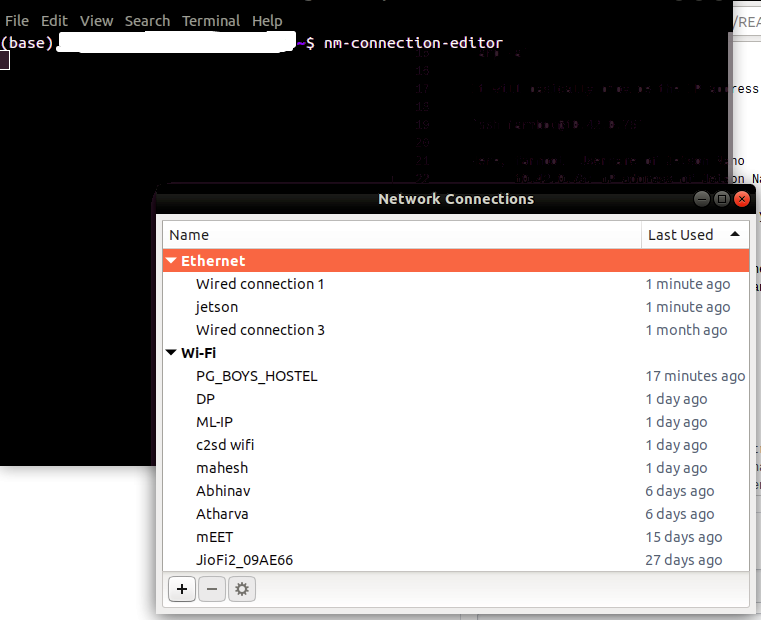
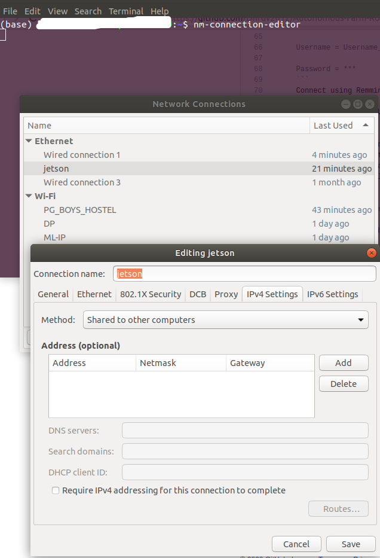

# Autonomous-Farm-Robot


# Remote Desktop for Jetson Nano
For Remote Control, user needs to know the username of the board so for the initial configuration display is required.

Controlling the board requires a display to be connected with board using HDMI. It does not support VGA compatible screens and hence requires HDMI compatible screens.
Apart from this, it can be controlled by the user remotely from his/her machine using the ssh connection.

SSH:
1. Insert the SD Card and connect the ethernet to the board to provide Internet connection.
2. Power on the board.
3. On the host machine type the following commands.

   `arp -a`
   
   It will basically provide the IP address of the Jetson.
   
   `ssh farmbot@10.42.0.75`
   
   Here, farmbot: Username of Jetson Nano
         10.42.0.75: IP address of Jetson Nano(found using `arp -a` or `ifconfig`) 
   
   Now that you can SSH in the Jetson from your own computer feel free to disconnect the monitor, keyboard, and mouse and        free up some space on your desk!

4. Now for the remote control, VNC Server needs to be installed and enabled on the Jetson nano.
   TYpe the following commands on Jetson nano.
    
     ```
     sudo apt update
     sudo apt install vino
     ```
     
     ```
     export DISPLAY=:0
     gsettings set org.gnome.Vino enabled true
     gsettings set org.gnome.Vino prompt-enabled false
     gsettings set org.gnome.Vino require-encryption false
     /usr/lib/vino/vino-server &
     ```
     Or make a bash script of the above commands and run the bash script.
     
     Bash Script:
     ```
     #!/bin/bash
     export DISPLAY=:0
     gsettings set org.gnome.Vino enabled true
     gsettings set org.gnome.Vino prompt-enabled false
     gsettings set org.gnome.Vino require-encryption false
     /usr/lib/vino/vino-server &
     ```
     Execute the script.
     ```
     chmod +x scriptname.sh
     bash scriptname.sh
     ```
     
     Then at host machine,activate Remmina  
     ```
     Group = WORKGROUP
     
     Protocol = VNC
     
     Server = IP_Address_of_host_or_usermachine  (Can be obtained by `arp -a` command)   
     
     Username = Username_of_host_or_usermachine
     
     Password = ***
     ```
     Connect using Remmina.
   
     And you have full GUI access of the board on your machine.
     
     # Problems faced:
     => It might hapen in some case the board gets ip address of 169.254.x.y. Using this ip address, one might able to login              using ssh connection, but the board might not get internet access and tasks like updating, upgrading and installing packages cannot be done.In this case, make sure you have shared your internet connection through ethernet.To do this,
     1.) Execute the following command on host machine where the jetson board is connected through wired connection(Ethernet).
     ```
     nm-connection-editor
     ```
     Now create a new Ethernet profile.
     
     
     
     Click on the + button to create and select Ethernet in connection type.
     
     In IPV4 settings change the method to "Shared to other computers".
     
     

     And you are set to go.

